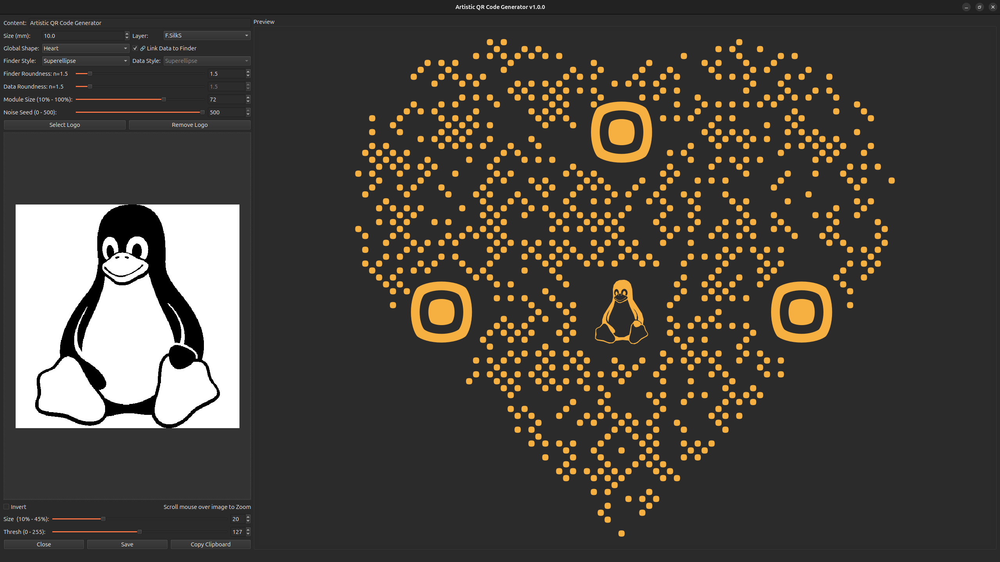

#  Fanout Tool

  

A powerful Python-based tool designed to generate artistic, vector-based QR codes specifically for **KiCad PCB designs**. 

Unlike standard QR generators that output raster images (PNG/JPG), this tool uses computational geometry (`Shapely`) to create precise **polygons** and exports them directly as **KiCad Footprint files (`.kicad_mod`)**. This allows you to place aesthetic, functional QR codes on your PCB's Silkscreen or Copper layers without quality loss.

## 🚀 Key Features

* **Vector-Based Generation**: Generates true geometry, not bitmaps. Perfect for manufacturing.
* **Artistic Styles**:
    * **Data Styles**: Liquid (blobby), Rounded, Superellipse, Circle, Square, Diamond.
    * **Finder Patterns**: Customize the 3 corner markers independently (e.g., Rounded, Diamond, Superellipse).
* **Global Shapes**:
    * **Square**: Standard QR code.
    * **Circle**: Crops the QR code into a circle (great for round PCBs).
    * **Heart**: Generates a heart-shaped QR code layout.
* **PCB Layer Support**:
    * Front/Back Silkscreen (`F.SilkS`, `B.SilkS`).
    * Front/Back Copper (`F.Cu`, `B.Cu`).
* **Logo Embedding**:
    * Import images (PNG/JPG).
    * **Auto-Vectorization**: Converts bitmap logos to vectors using OpenCV contours.
    * **Auto-Fit**: Automatically scales logos to fit the center.
    * **Smart Removal**: Clears data modules behind the logo to ensure readability.
* **Live Preview**: Real-time rendering with Zoom/Pan capabilities (powered by Qt).

## 🛠️ Installation

### Via KiCad Plugin and Content Manager (Recommended)
Add our custom repo to **the Plugin and Content Manager**, the URL is:
`https://raw.githubusercontent.com/thanhduongvs/kicad-repository/main/repository.json`

### Manual Installation
- Download the plugin source code as **a .zip** file.
- Locate your KiCad plugins folder:
  - **Windows:** `Documents\KiCad\9.0\plugins`
  - **Linux:** `~/.local/share/kicad/9.0/plugins`
  - **macOS:** `~/Documents/KiCad/9.0/plugins`
- Extract the archive to the KiCad plugins directory
- Restart KiCad / PCB Editor.

## 🖥️ Usage

1. Open **PCB Editor**.
2. Go to **Tools** -> **External Plugins** -> **Artistic QR Code Generator** (or click the icon on the toolbar).
3. Configure your QR code (Content, Size, Style).
4. Click **Select Logo** if you want to embed an image.
5. Click **Save** to generate a `.kicad_mod` file or **Copy Clipboard** to paste directly onto your PCB.

## Demo Video

## 📦 Libraries Used
This project relies on several powerful open-source libraries:
 - [PySide6](https://pypi.org/project/PySide6/): The official Python module from the Qt for Python project, used for the graphical user interface.
 - [Shapely](https://pypi.org/project/shapely/): Used for computational geometry operations (Union, Difference, Buffer) to create the "Liquid" effects and smooth shapes.
 - [qrcode](https://pypi.org/project/qrcode/): The standard Python library for generating the raw QR matrix.
 - [OpenCV](https://pypi.org/project/opencv-python/): Used for processing user logos, detecting contours, and converting bitmaps to vectors.
 - [NumPy](https://pypi.org/project/numpy/): Essential for efficient matrix manipulation and coordinate calculations.
 - [Pillow](https://pypi.org/project/pillow/): Used for image loading and basic processing before vectorization.

## 📜 License and Credits

Plugin code licensed under MIT, see `LICENSE` for more info.

 - This project was heavily inspired by the beautiful generative art concepts found in [QRFrame](https://qrframe.kylezhe.ng).