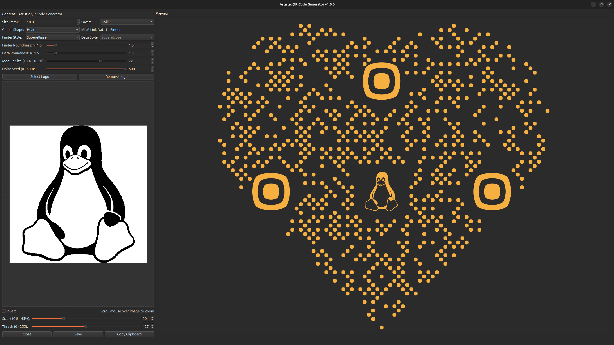

#  KiCad Fanout Tool

  

A powerful Python-based plugin designed to automate escape routing (fanout) for dense IC packages in **KiCad PCB designs**. 

Routing dense components like QFNs, QFPs, and BGAs manually can be tedious and time-consuming. This tool automates the process using professional-grade algorithms (like 3-Segment Routing) to generate clean, DRC-error-free tracks and vias instantly.

## 🚀 Key Features

* **Advanced Routing Algorithms**: Implements robust 3-Segment Routing (Stub -> 45° Bend -> Straight) to prevent track criss-crossing and DRC collisions, especially in the tight corners of 4-sided packages.
* **Versatile Alignment Modes**:
    * **Fan Escape**: Radially distributes vias to save space and organize outer connections.
    * **Staggered Fan/Linear**: Generates multiple aligned rows of vias (Inner & Outer) perfectly to maximize routing channels.
* **Full Parameter Control**:
    * **Fanout Length**: Customize the exact clearance distance from the pad to the via.
    * **Stagger Gap**: Adjust the distance between multiple rows of vias.
    * **Via Pitch**: Set specific distances between vias independently of the IC's pad pitch.
* **Smart Package Detection**: Automatically adapts to 2-sided (SOIC, TSSOP) and 4-sided (QFP, QFN) footprints, whilst automatically ignoring center Exposed Pads (EP/Thermal pads).
* **Safe & Reversible**: Features a built-in Undo system to instantly revert generated tracks and vias for safe experimentation.

## 🛠️ Installation

### Via KiCad Plugin and Content Manager (Recommended)
Add our custom repo to **the Plugin and Content Manager**, the URL is:
`https://raw.githubusercontent.com/thanhduongvs/kicad-repository/main/repository.json`

### Manual Installation
- Download the plugin source code as **a .zip** file.
- Locate your KiCad plugins folder:
  - **Windows:** `Documents\KiCad\9.0\plugins`
  - **Linux:** `~/.local/share/kicad/9.0/plugins`
  - **macOS:** `~/Documents/KiCad/9.0/plugins`
- Extract the archive to the KiCad plugins directory.
- Restart KiCad / PCB Editor.

## 🖥️ Usage

1. Open **PCB Editor**.
2. Select the footprint (IC) you want to fanout.
3. Go to **Tools** -> **External Plugins** -> **Fanout Tool** (or click the icon on the top toolbar).
4. Configure your parameters:
   - Target Package (e.g., SOIC/QFN)
   - Alignment Style (Fan Escape, Staggered, Linear)
   - Customize Distances (Fanout length, Stagger gap, Via pitch).
5. Click **Run Fanout** to generate the tracks and vias.
6. (Optional) Use the built-in **Undo** button if you want to tweak parameters and try again.

## Demo Video

## 📦 Libraries Used
This project relies on several powerful open-source libraries:
 - [kicad-python](https://pypi.org/project/kicad-python/): KiCad API Python Bindings.
 - [PySide6](https://pypi.org/project/PySide6/): The official Python module from the Qt for Python project, used for the graphical user interface.

## 📜 License and Credits

Plugin code licensed under MIT, see `LICENSE` for more info.